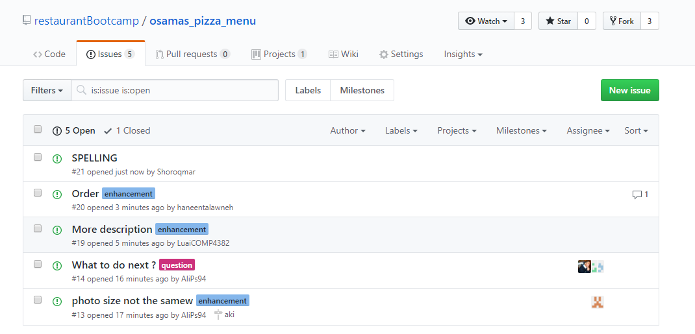

# GitHub Lab Competition
## Ramzi Burger vs. Osama's Pizza


### Instructions
For this lab you will be split into two teams.  This is a competition and you must add all of the functionalities discussed in this lab exercise.  A winner will be chosen based on how well and how quickly you implement all of the components of this challenge.  As resourceful developers, it will be your responsibilty to search the Internet to learn how to complete each challenge quickly.

# Let the games begin!
 
## Creating your Organization
Create an organization for restaurant on Github.  Also create a respository inside your organization called ```ramzi_burger_menu``` or ```osamas_pizza_menu``` accordingly. Initialize your repo with a README file so you can immediately clone.
### Adding Team Members and Collaborators
Add the rest of your team to the organization, what permissions does each team member have? Modify the permissions as you see fit.  Place their username and permissions below:

```
..*AlaaZuhour Owner
..*AliPs94 Owner
..*amr-213 Owner
..*dev-zeina Owner
..*haneentalawneh Owner
..*LuaiCOMP4382 Owner
..*MohammadIbrahim Owner
..*Shoroqmar Owner

```


Add your instructor (@lrnzbr) as a collaborator.
What is the difference between a team member and a collaborator on GitHub?


```Outside collaborators only have access to repositories that their team membership allows. Outside collaborators cannot create teams or view all the organization’s members and teams.```

### Markdown, Pull Requests & Conflict Resolutions
Each team member should clone a copy of the repository to their local machine. From here they should make a branch.  *Always make a new branch when you are adding a feature to an existing repository.*

In each local repository you will make a new file called ```<your_name>.md```. In this markdown file you will create a personal info page about yourself including your name, picture, top 5 favorite songs in an unordered list , and an example on how to write a ‘for loop’ in your favorite language .  There are lots of tutorials and tools for writing Markdown on the web, find one that you like best.  


When you are finished, pull, push and submit a pull request to the master repo for the owners to merge.

__Now let’s make some conflict!__

In the README file, you will create a menu for your restaurant.  Every team member should add at least 3 items (with a price, description and picture)  to the menu and submit another pull request.  One team member should be responsbile for decorating the readme markdown so it looks like a presentable restaurant menu.  Solve this problem and resolve all merge conflicts as a team.  


### Bug Tracking

Picture:  


In Github, the center for all bug tracking are the Issues. Even though they are primarily for bug tracking, it is also helpful to use Issues in the following ways:

*  Bugs: Things that are obviously broken and need fixes
* Features: Awesome cool new ideas to implement
* To do list: A checklist of items to complete

Let's explore some of the features of Issues:

* Labels: They are colored categories for each issue. They are helpful for filtering issues accordingly.
* Milestones: They are dated categories that can be associated with each issue and are useful for identifying what issues need to be worked on for the next release. Also since Milestones are connected to issues, it automatically updates the progress bar upon closing each associated issue.
* Search: Auto-complete search for both issues and milestones
Assignment: Each issue can be assigned to a person in-charge to fix the issue. It is another useful feature to see what we should be working on.
* Auto-close: Commit messages with Fixes/Fixed or Close/Closes/Closed #[issue-number] will automatically close the issue.
* Mentions: Anyone can also leave a note by just indicating #[issue-number] in their messages. Because the issue numbers are hyperlinked, this makes it really easy to mention related issues during discussion.

Use the Bug Tracking Feature in GitHub and provide screenshots of these features in use.

### Code Review
Sometimes you want to see the differences between code branches.  See if you can figure out how to use the compare feature in Github to see the code changes between two different branches of your repo.  Attach screenshots of these code comparisons to this document.  

### Documenting
Adding supplemental documentation helps developers better understand projects and communicate with each other.  You can formally maintain documentation using the GitHub Wiki or use a fun Github Hubot to have fun meme and emoji-filled conversations with your team.  Implement a form of documentation in your organization and attach screenshots below.

### Analytics
There are two tools that give insight into a repository - Graphs and Network. Github Graphs provides an insight into the collaborators and commits behind each code repository, while Github Network provides a visualization on each contributors and their commits across all forked repositories. These analytics and graphs become very powerful, especially when working in teams.
Utilize these analytics tools in your repository and attach a screenshot of your findings.  

### Project Management
While Github Issues have project management capabilities with Issues and Milestones, some teams might prefer another tool because of other features or existing workflow. With Github service hooks, we can automate updating task with commits, issues and many other activities.  In this challenge, link Github with a popular project management tool - Trello or Pivotal Tracker. This automation helps in not only saving time, but also increases accuracy in updates for any software development team.  Provide screenshots and captions to show that you have project management integrations working on your organization’s account.  

### Continuous Integation
Continuous Integration (CI) is an important part of all software development projects that work with teams. CI ensures that, when a developer checks in their code, an automated build (including tests) detects integration errors as fast as possible. This definitely reduces integration errors and makes rapid iteration much more efficient. In this challenge, use a CI package and integrate it into your development workflow.  Add a small Flask/Node.js/Java application to your repo such that the CI package can check for errors.  Provide screenshots and captions of this implementation below.  


...And that's it. You're a GitHub expert now!


